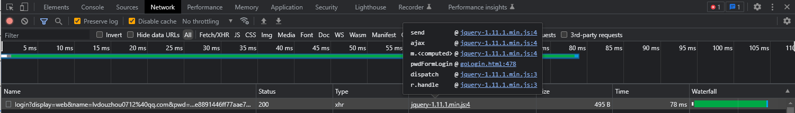

目标网站：aHR0cHM6Ly9vYXV0aC5kLmNuL2F1dGgvZ29Mb2dpbi5odG1s

一、 输入账号密码，获取登录接口，寻找加密参数

通过请求接口我们可以看到， pwd 是加密之后的参数。需要进行逆向操作。

二、定位加密参数位置

通过 initiator 定位发起 url 请求的位置

一个小技巧一般 jquery 的我们都不需要看，直接点击第 4 个跳转，格式化代码之后打上断点，再重新请求数据。

鼠标移动到 submitData 就能看到里面的数据，或者在控制台输入 submitData  也能看到数据。

可以看到我们要找的加密参数 pwd 。我们先向上看看代码分析一下，发现了我们输入的明文的密码。那加密逻辑一定就在附近了。

通过分析我们找到第 457 传入的参数是未加密的密码，返回的就是加密的 pwd 。通过方法的名字我们也可以知道这是一个 RSA 非对称加密算法。

三、分析加密函数

取消之前所有断点。然后重新在 457 行下断点，输入账号密码之后，程序会到加密函数这里断住。

鼠标移动到 rsa 加密方法上

我们可以看到这个加密函数所在的行数，点击跳转。

bingo!! 找到加密函数啦！！妥妥的 rsa 加密

四、扣代码，补环境

这里我们不去一步步的去缺啥补啥了，因为这里的加密函数都是在单独的js 中，我们复制所需的js 到本机即可得到加密后的 pwd。

setMaxDigits 在  BigInt.js 中，RSAKeyPair 和 encryptedString 都在 RSA.js 中。在执行 js 时会有 BarrettMu
未定义，经过调试可以发现这个函数在 Barrett.js 里面  。直接 cv 大法弄到本地放到一个 js 中，放的过程注意一下顺序即可

最后运行js 

没毛病。

五、python 请求接口

